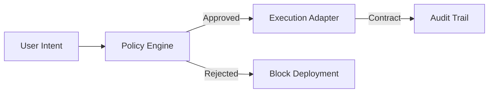

# GlassOps Architecture & Design

> **The Blueprint for the Governance Control Plane.**

---

## 1. High-Level Architecture

GlassOps uses a **Container-First Architecture** where GitHub acts as the Control Plane and specialized Containers act as Execution Adapters.

### The Control Loop

### Component Breakdown

1.  **Control Plane (GitHub)**: Owns state, secrets, and policy resolution.
2.  **Runtime Primitive**: Bootstraps the environment (CLI, Auth).
3.  **Adapters**: Stateless workers that execute commands and normalize output.
4.  **Protocol**: The message format (SARIF/OTel) exchanged between components.

---

## 2. Governance Flow (The Pipeline)

Deployment is not a single step; it is a 4-phase governance process.

1.  **Phase 1: Policy Resolution**
    - Merges `GitHub Vars` (Floor) + `devops-config.json` (Team) + `Salesforce CMDT` (Additive).
    - Result: A single `Effective Policy`.

2.  **Phase 2: Architectural Validity**
    - Static analysis checks (PMD/ESLint).
    - Enforces **Hard Invariants** (e.g., No RunAllTests in Prod).

3.  **Phase 3: Simulation (The Dry Run)**
    - Runs the specific adapter in `check-only` mode.
    - Generates a **Draft Contract** (SARIF).

4.  **Phase 4: Execution Gate**
    - The Governance Engine compares **Draft Contract** vs **Effective Policy**.
    - If `Pass` -> Execute Quick Deploy.
    - If `Fail` -> Block.

---

## 3. Security Model

### Confused Deputy Protection

**Principle:** Salesforce never holds deployment secrets. GitHub holds secrets and requests a token via JWT.

- **Benefit:** If Salesforce is compromised, they cannot deploy to other envs. If GitHub is compromised, scope is limited to the specific repo environment.

### Secrets Management

- **Location:** GitHub Secrets (Environment Scoped).
- **Rotation:** 90-day automated rotation for JWT keys.

---

## 4. Failure Modes & Recovery

| Failure | Behavior | Recovery |
| (System) | (Workflow) | (Manual) |
|---|---|---|
| **GitHub Down** | Deployment Impossible | Manual `sf deploy` from local machine (Break Glass) |
| **Salesforce Down** | Workflow Fails Gracefully | Retry when service restored |
| **Policy Block** | Workflow Fails (Intentional) | Fix code or Request `Manual Override` |

---

## 5. Directory Structure

- `packages/control-plane`: The Policy decision logic.
- `packages/runtime`: The environment boostrapper.
- `packages/adapters/*`: The execution workers.
- `packages/glassspec`: The protocol definitions.
