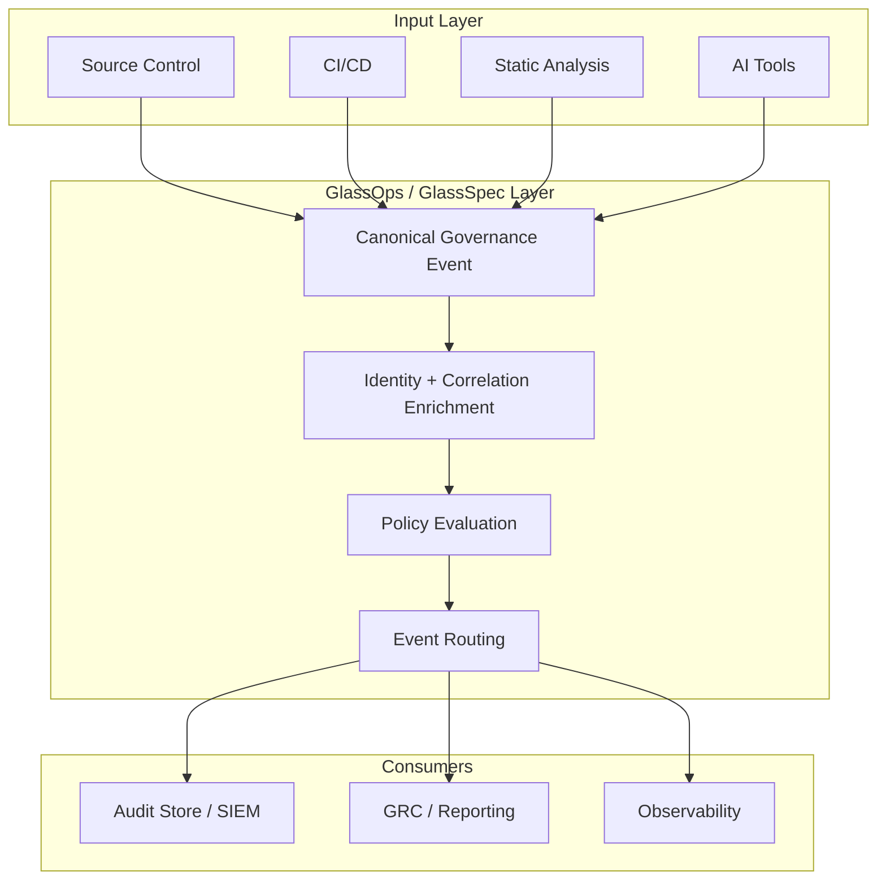

# GlassOps White Paper

## Governance as a Protocol for Modern Software Delivery

**External Edition | March 2026**

> [!NOTE]
> This paper describes the current architectural direction of GlassSpec and the current platform design of GlassOps. Both are in active development.

---

**Abstract**

Enterprise software delivery now spans source control, CI/CD, static analysis, ticketing, deployment systems, and AI coding tools. Each system emits its own logs, models identity differently, and stores evidence in isolation. The result is fragmented governance: policies are difficult to enforce consistently, audit trails are difficult to reconstruct, and AI-assisted development is often only partially visible.

**GlassOps addresses this by treating governance as a protocol layer rather than a per-tool feature.** Built on GlassSpec, a canonical event model for development governance, GlassOps normalizes development activity into correlation-rich, policy-evaluable events that can be routed to policy engines, audit stores, and existing enterprise systems.

GlassSpec defines the protocol. GlassOps operationalizes it as a platform for policy enforcement, identity correlation, and continuous audit evidence across heterogeneous toolchains.

---

## 1. The Governance Problem

Modern engineering organizations rely on a patchwork of tools:

- Source control platforms
- CI/CD systems
- Security and static analysis scanners
- Ticketing and workflow systems
- Cloud and deployment platforms
- AI coding assistants

Each tool has its own event format, actor model, and audit record. Security and compliance teams are then left to answer cross-system questions manually:

- Who initiated a change, and which tools acted on their behalf?
- Did a release pass all required policy checks?
- Can we reconstruct a complete evidence trail for a production incident?
- Was AI involved in a change, and under what policy?

This is not primarily a policy-writing problem. It is a systems-integration problem.

> [!IMPORTANT]
> There is no shared governance substrate across the software delivery toolchain. Every tool speaks a different governance dialect.

### The Integration Economics

| Integration Model | Structure                                          | Scale   |
| ----------------- | -------------------------------------------------- | ------- |
| Point-to-point    | Each producer integrates directly to each consumer | `N x M` |
| Protocol layer    | Each producer emits once; each consumer reads once | `N + M` |

For governance, this matters operationally. Adding a new AI tool, scanner, or CI platform should require one adapter, not a new round of bespoke integrations into every downstream audit or policy system.

---

## 2. Governance as a Protocol

GlassOps reframes the problem: instead of embedding governance separately into every tool, it introduces a protocol layer that tools emit into and governance consumers read from.

In practical terms:

1. Development tools emit canonical governance events.
2. Those events retain identity, source, correlation, and outcome context.
3. Policy engines, audit stores, dashboards, and GRC systems consume the same normalized stream.

This makes governance portable across tools in the same way standard network protocols made communication portable across systems.

### GlassSpec vs. GlassOps

| Term          | Role                                                                                |
| ------------- | ----------------------------------------------------------------------------------- |
| **GlassSpec** | The protocol and canonical event model for development governance                   |
| **GlassOps**  | The platform that ingests, enriches, routes, stores, and evaluates GlassSpec events |

### Day 1 Value

The protocol is designed to deliver useful value without replacing existing systems:

- Unified identity correlation across multiple development systems
- A single event format for policy and audit consumers
- Better traceability from commit to pipeline to deployment
- Improved visibility into AI-assisted development

The initial deployment model is additive: instrument high-value producers first, route events to existing systems, and expand enforcement gradually.

---

## 3. The Universal Event Model

The core GlassSpec artifact is a universal governance event. Each event preserves what happened, who was involved, where it happened, and how it relates to other events.

### Canonical Field Groups

| Field Group     | Purpose                                                                    |
| --------------- | -------------------------------------------------------------------------- |
| **Identity**    | Who initiated the action and what executed it                              |
| **Source**      | Which tool, repository, environment, or ingestion point produced the event |
| **Correlation** | Join keys such as commit SHA, CI run ID, pull request, or trace context    |
| **Payload**     | Raw tool output plus normalized summary data for policy evaluation         |

This structure is designed to align closely with enterprise audit record expectations while remaining practical for real-time routing and policy evaluation.

### Illustrative Event Envelope

```jsonc
{
    "event_type": "static_analysis.completed",
    "spec_version": "1.0",
    "occurred_at": "2026-02-28T19:05:22Z",
    "identity": {
        "initiator": {
            "kind": "human",
            "canonical_id": "user:12345",
            "display": "dev-handle"
        },
        "executor": {
            "kind": "service",
            "canonical_id": "service:ci-runner"
        },
        "ai_co_actor": null
    },
    "source": {
        "environment": "ci",
        "repository": "org/repo",
        "tool": { "name": "static-analyzer-x", "version": "4.2.1" }
    },
    "correlation": {
        "commit_sha": "abc123deadbeef",
        "ci_run_id": "ci-987654",
        "pull_request_id": "PR-1042"
    },
    "payload": {
        "format": "sarif",
        "summary": { "critical": 0, "high": 2, "medium": 7 },
        "outcome": "completed_with_warnings"
    }
}
```

Two design choices matter here:

- Raw tool output can be preserved for audit completeness.
- Normalized summary fields allow policy to operate consistently across heterogeneous tools.

---

## 4. From Commit to Audit

GlassOps is designed as an event pipeline for governance:

1. A developer action occurs, such as a commit or pull request update.
2. A producer plugin emits a canonical event.
3. Identity and correlation context are enriched.
4. Policy engines evaluate the event.
5. Audit consumers store both the original event and resulting policy decisions.

The outcome is not just logging. It is a joinable governance record that can follow a change across tools and stages of delivery.

### Reference Architecture



This is a reference deployment, not a required implementation.

---

## 5. Why Existing Platforms Do Not Fully Solve This

Enterprises already have SIEM, observability, and analytics infrastructure. Those systems remain important, but they do not define governance semantics for the software delivery chain.

- **SIEMs** are strong audit consumers, but usually rely on custom parsing and normalization from developer tools.
- **Observability platforms** model operational behavior well, but not governance concepts such as policy decisions, actor attribution, or durable control evidence.
- **General analytics platforms** can store and query events, but they do not provide a canonical governance model by themselves.

> [!NOTE]
> **The semantic gap:** Operational telemetry answers what the system did. Governance records answer who did what, under what policy, with what outcome, and where the evidence lives.

GlassOps sits upstream of those systems by producing normalized governance events they can consume.

---

## 6. The AI Governance Dimension

AI coding assistants introduce a new governance challenge: meaningful participation in software delivery by non-human tools that often have limited native auditability.

GlassSpec treats AI participation as a first-class field in the event model rather than an afterthought in logs. This makes it possible to:

- Record when approved or detected AI tools were present in a development session
- Capture tool identity, version, and attribution method where available
- Distinguish between declared, detected, and inferred participation
- Apply review and disclosure policy to AI-assisted changes

### Example Policy Questions

- Was an approved AI tool used?
- Was AI usage disclosed where required?
- Should AI-assisted changes receive additional review?

Organizations may choose different attribution models depending on policy, tooling, and regulatory context. These can range from direct tool integration and developer declaration to optional enterprise-side telemetry signals governed by privacy and legal controls. Where inference is used, GlassOps preserves confidence, provenance, and policy context so downstream systems can distinguish authoritative attribution from supplementary signals rather than treating them as equivalent evidence.

---

## 7. Standards Alignment

GlassOps is designed as augmentation infrastructure, not as a replacement for enterprise governance frameworks.

Its event model and policy trail are intended to support:

- **NIST SP 800-53 Rev. 5** audit and accountability evidence
- **ISO/IEC 27001:2022** process traceability and control evidence
- **NIST AI RMF 1.0** continuous AI governance assessment
- **CloudEvents** interoperability patterns for event transport
- **W3C Trace Context / OpenTelemetry** correlation with operational telemetry
- **SARIF** preservation of static-analysis artifacts

These are architectural alignments, not claims of certification or control inheritance.

---

## 8. Deployment Model

GlassOps is designed for additive adoption:

1. Instrument a small number of high-value producers.
2. Route canonical events to existing audit and security systems.
3. Start policy in warn mode.
4. Expand producer coverage and enforce incrementally.

This matters commercially as well as technically. Enterprises rarely want to replace existing tooling to gain better governance. A protocol layer is easier to evaluate when it complements current investments.

---

## 9. Example Scenarios

### AI-Assisted Commit Missing Disclosure

- A commit event includes AI attribution metadata.
- Policy detects that required disclosure is missing.
- A policy decision is emitted and the merge path is blocked or warned, depending on configuration.

### Static Analysis Findings Across Multiple Tools

- Multiple scanners emit results in different raw formats.
- GlassSpec preserves the original artifacts while normalizing summary fields.
- A single policy gate evaluates severity thresholds consistently across tools.

### Cross-System Incident Reconstruction

- A production incident is traced back through deployment, CI, and source control events.
- Shared correlation keys enable a unified governance timeline without manual log stitching.

---

## 10. Conclusion

Software delivery has become more automated, more distributed, and more AI-assisted. Governance has not kept pace because it is still fragmented across tools, identities, and event formats.

GlassOps addresses this by making governance a protocol concern. GlassSpec provides a canonical event model for development governance. GlassOps turns that model into an operational platform for policy evaluation, identity correlation, and durable audit evidence across heterogeneous toolchains.

**The protocol architecture is substrate-agnostic.** While this paper focuses on software delivery toolchains, GlassSpec is designed as a canonical governance event model that can extend to adjacent domains over time. The same pattern of canonical events, identity correlation, and policy evaluation may apply to other enterprise control planes, but those expansions are outside the scope of this paper.

> [!IMPORTANT]
> Governance that remains tool-bound will continue to fragment at the rate of the toolchain. A protocol layer makes auditability, policy enforcement, and cross-system correlation properties of the delivery process itself.

---

_© 2026 GlassOps — Ryan Bumstead — External White Paper_
