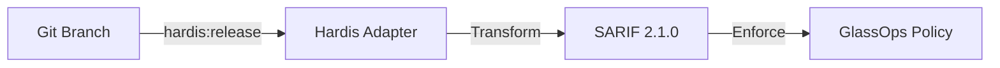

# GlassOps Hardis Adapter

> [!IMPORTANT]
> This adapter invokes [sfdx-hardis](https://github.com/hardisgroupcom/sfdx-hardis), licensed under AGPL-3.0. Users must install and comply with the license terms. Failure to do so could result in legal obligations to provide source code to downstream users.

> **High-Velocity Adapter for sfdx-hardis**
> **Version:** 1.0 (Stable)
> **Effective Date:** 2026-01-24
> **Next Review:** 2026-07-24

> **Architecture Role:** Integration Layer (Orchestrator)
> **Phase:** 4 (Execution)

## Role in GlassOps Protocol

The **Hardis Adapter** wraps the powerful [sfdx-hardis](https://github.com/hardisgroupcom/sfdx-hardis) orchestration engine. It is designed for teams prioritizing velocity and automated release management simplification.

This adapter bridges Hardis's opinionated workflows (like automated packaging and dependency handling) with the rigorous audit requirements of the GlassOps Protocol.

## 🔄 Data Flow



1.  **Input:** Git Branch / Release Configuration
2.  **Execution:** `sf hardis:project:deploy` (Orchestrated)
3.  **Output:** SARIF 2.1.0 Governance Contract

## 🚀 Usage

### GitHub Actions

```yaml
- name: Deploy with Hardis Adapter
  uses: glassops-platform/glassops-hardis-adapter@v1
  with:
      org-alias: production
      packaging-strategy: automated
      policy-profile: high-velocity
```

## 🛡️ Governance Capabilities

| Feature                | Supported | Description                                  |
| :--------------------- | :-------- | :------------------------------------------- |
| **Dependency Mgmt**    | ✅        | Automatically validates package dependencies |
| **Incremental Deploy** | ✅        | Smart delta deployment mapped to SARIF audit |
| **Pre-Validation**     | ✅        | Dry-run simulations included in contract     |

## ⚖️ Legal & Compliance

**Layer:** Integration (Adapter / CLI / Sidecar)

> [!IMPORTANT]
> **User Obligation:** Users integrating this adapter **must** ensure that any use of `sfdx-hardis` complies with [AGPL-3.0](https://www.gnu.org/licenses/agpl-3.0.html), including providing access to source code to their downstream users as required by the license.

### Compliance Checklist

- [x] Runs as isolated process
- [x] No core linking
- [x] Official release used
- [x] License notice provided

### Implementation Details

This adapter runs sfdx-hardis as an isolated subprocess. GlassOps does not modify, bundle, or redistribute sfdx-hardis. Users are responsible for installing a compliant version and ensuring AGPL-3.0 compliance, including making the tool’s source code available to downstream users. Source is available at [Hardis GitHub](https://github.com/hardisgroupcom/sfdx-hardis). No code is imported or linked into GlassOps binaries.

See the `NOTICE` file for attribution information and license details.
