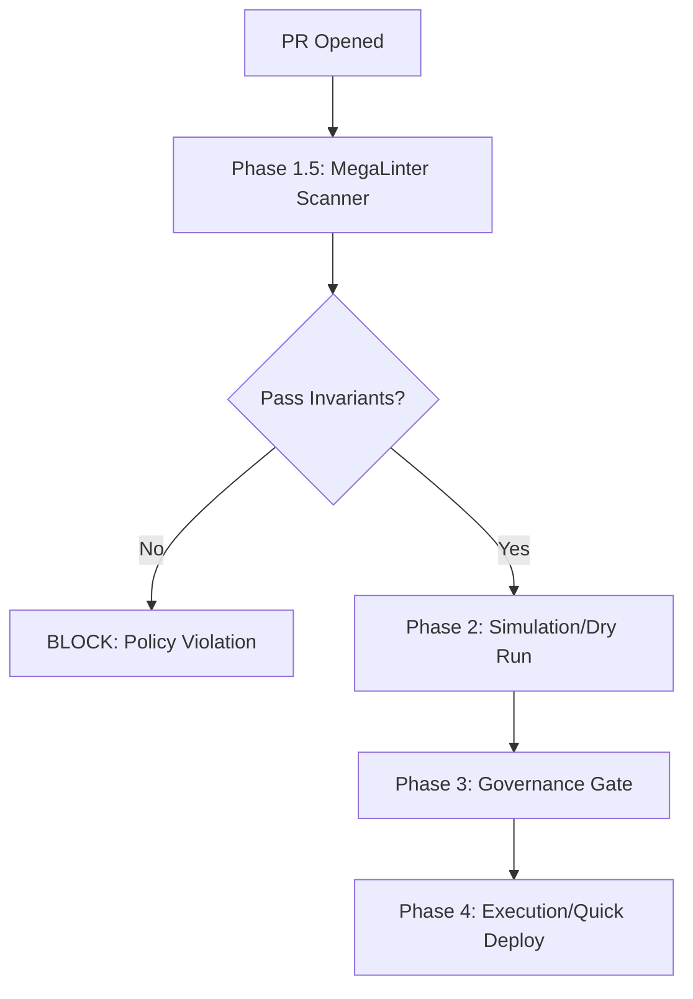

# MegaLinter Scanner Adapter

> [!IMPORTANT]
> This adapter invokes [MegaLinter](https://github.com/oxsecurity/megalinter), licensed under AGPL-3.0. Users must install and comply with the license terms. Failure to do so could result in legal obligations to provide source code to downstream users.

**Version:** 0.1 (Draft)
**Effective Date:** 2026-01-24
**Next Review:** 2026-07-24
**Architecture Role:** Integration Layer (Scanner)
**Phase:** 1.5 (Validation / Gate)

## Concept

This adapter runs **MegaLinter** to perform static analysis on the codebase. It acts as the **Phase 1.5 Gate**, ensuring architectural validity before any deployment simulation occurs.

### Fail-Fast Workflow



### Atomic Contract Integration

Since MegaLinter runs first, it is responsible for **initializing the Deployment Contract**.

- It must assume the contract does not exist.
- It must write the file atomically (write to temp → rename) to avoid race conditions.
- This contract serves as the atomic base, allowing subsequent steps to append their results safely.

## Security Governance (The Floor)

GlassOps enforces an absolute security floor using GitHub Environment variables.

**Example:** `GLASSOPS_BLOCK_ON_SEVERITY=critical`

This ensures that even if a developer ignores a rule in their local config, the platform will block the deployment if a Critical severity issue is found.

## Contract Extension (Proposed v1.1)

We will extend the `quality` object in the Deployment Contract:

```json
{
    "quality": {
        "staticAnalysis": {
            "tool": "MegaLinter",
            "format": "SARIF-2.1.0",
            "summary": {
                "critical": 0,
                "high": 2,
                "medium": 5,
                "low": 10
            },
            "blockingViolations": [],
            "met": true
        }
    }
}
```

## Policy Configuration

In `devops-config.json`:

```json
"governance": {
    "staticAnalysis": {
        "enabled": true,
        "blockOn": ["critical", "high"],
        "ignoreRules": ["apex-doc"]
    }
}
```

## ⚖️ Legal & Compliance

**Layer:** Integration (Adapter / CLI / Sidecar)

> [!IMPORTANT]
> **User Obligation:** Users integrating this adapter **must** ensure that any use of `MegaLinter` complies with [AGPL-3.0](https://www.gnu.org/licenses/agpl-3.0.html), including providing access to source code to their downstream users as required by the license.

### Compliance Checklist

- [x] Runs as isolated process
- [x] No core linking
- [x] Official release used
- [x] License notice provided

### Implementation Details

This adapter runs MegaLinter as an isolated subprocess. GlassOps does not modify, bundle, or redistribute MegaLinter. Users are responsible for installing a compliant version and ensuring AGPL-3.0 compliance, including making the tool’s source code available to downstream users. Source is available at [MegaLinter GitHub](https://github.com/oxsecurity/megalinter). No code is imported or linked into GlassOps binaries.

See the `NOTICE` file for attribution information and license details.
