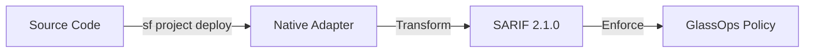

# GlassOps Native Adapter

> [!NOTE]
> This adapter uses standard Salesforce CLI tooling. GlassOps manages governance envelopes but relies on the underlying CLI for execution.

> **Governance-First Adapter for Salesforce CLI (`sf`)**

## Role in GlassOps Protocol

The **Native Adapter** is the reference implementation for bridging raw Salesforce CLI execution with the GlassOps Control Plane. It executes standard deployment commands while transparently normalizing results into the **Universal SARIF Contract**.

Unlike black-box DevOps tools, this adapter provides maximum transparency—you see exactly what `sf` commands are running, but with an added layer of governance enforcement.

## 🔄 Data Flow



1.  **Input:** Salesforce Metadata (Source Format)
2.  **Execution:** `sf project deploy start` (System Native)
3.  **Output:** SARIF 2.1.0 Governance Contract (containing component success/failures, code coverage, and test results)

## 🚀 Usage

### GitHub Actions

```yaml
- name: Deploy with Native Adapter
  uses: glassops-platform/glassops-native-adapter@v1
  with:
      target-org: production
      source-dir: force-app
      test-level: RunLocalTests
      wait: 30
```

## 🛡️ Governance Capabilities

| Feature                | Supported | Description                                              |
| :--------------------- | :-------- | :------------------------------------------------------- |
| **Code Coverage**      | ✅        | Enforces min-coverage policies defined in Control Plane  |
| **Test Results**       | ✅        | Normalizes JUnit output to SARIF results                 |
| **Component Manifest** | ✅        | Lists every component deployed in the immutable contract |
| **Rollback Support**   | ⚠️        | Supports standard `sf` quick deploy rollbacks            |
