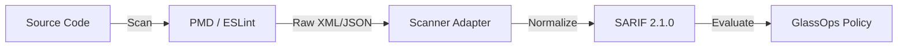

# GlassOps Scanner Adapter

> [!NOTE]
> This adapter invokes scanning tools as external execution engines. GlassOps does not bundle, modify, or redistribute these tools. Users are responsible for providing compliant installations or images.

> **Universal Code Quality Adapter (SARIF-Native)**

## Role in GlassOps Protocol

The **Scanner Adapter** is the "eyes" of the governance platform. It runs static analysis tools (PMD, ESLint, GraphEngine) and normalizes their heterogeneous outputs into a single, unified SARIF stream for policy evaluation.

It is key to enforcing Architectural Decision Records (ADRs) as code limits (e.g., "No DML in Loops", "Must use Logger class").

## 🔄 Data Flow



1.  **Input:** Source Code (Apex, JS, XML, etc.)
2.  **Execution:** Multi-engine analysis
3.  **Output:** SARIF 2.1.0 Governance Contract (Violations mapped to Blocking/Warning policies)

## 🚀 Usage

### GitHub Actions

```yaml
- name: Governance Scan
  uses: glassops-platform/glassops-scanner-adapter@v1
  with:
      target: force-app
      engines: pmd, eslint, retire-js
      severity-threshold: 2
```

## 🛡️ Governance Capabilities

| Feature             | Supported | Description                                         |
| :------------------ | :-------- | :-------------------------------------------------- |
| **ADR Enforcement** | ✅        | Maps static rules to Architectural Decision Records |
| **Security Gates**  | ✅        | Blocks on CVEs and critical vulnerabilities         |
| **Tech Debt Vis**   | ✅        | Quantifies debt in the governance dashboard         |
