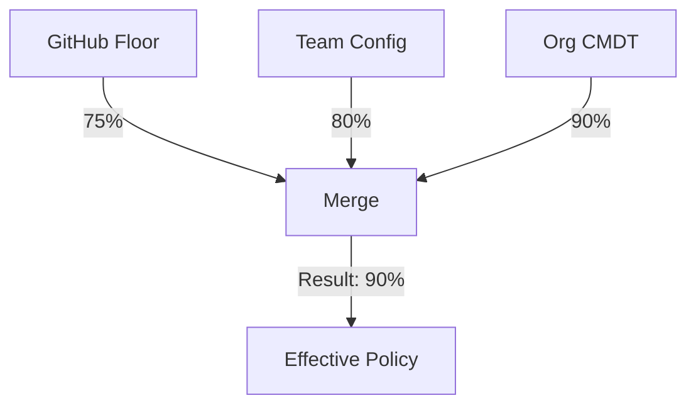

# GlassOps Control Plane (`@glassops/control-plane`)

> **The Brain of the Operation.**
>
> The Control Plane is responsible for **Decision Making**. It does not execute deployments; it decides if they _should_ execute.

---

## 1. Core Logic: Policy Resolution

The Control Plane implements the **Additive Governance Model**.



### The Invariant

> **"Policy can strictly be raised, never lowered."**

If GitHub says `minCoverage: 75`, a `devops-config.json` requesting `50` will be ignored (or blocked). The merge function is strictly `MAX(sources)`.

---

## 2. Ingestion & SARIF Specification

GlassOps standardizes on **SARIF 2.1.0** for all governance findings.

### 2.1 Why SARIF?

1.  **Standardization:** Adopted by Microsoft, GitHub, Google.
2.  **Interoperability:** Visualized natively by GitHub Security tab.
3.  **Future-Proofing:** Compatible with future AI analysis tools.

### 2.2 Standard Ingestion Payload

The Control Plane accepts specific SARIF structures.

```json
{
    "$schema": "https://schemastore.azurewebsites.net/schemas/json/sarif-2.1.0-rtm.5.json",
    "version": "2.1.0",
    "runs": [
        {
            "tool": {
                "driver": { "name": "GlassOps Adapter" }
            },
            "results": [
                {
                    "ruleId": "GOV-001",
                    "level": "error",
                    "message": { "text": "Coverage 72% < 75%" },
                    "locations": [
                        {
                            "physicalLocation": {
                                "artifactLocation": { "uri": "force-app/classes/AccountTrigger.cls" }
                            }
                        }
                    ]
                }
            ]
        }
    ]
}
```

### 2.3 CloudTrail to SARIF Mapping

For cloud events (like AWS CloudTrail), we map concepts as follows:

| CloudTrail Field    | SARIF Field        | Meaning                                        |
| ------------------- | ------------------ | ---------------------------------------------- |
| `eventName`         | `ruleId`           | The type of violation (e.g., UNAUTHORIZED_S3). |
| `requestParameters` | `physicalLocation` | The resource that drifted.                     |
| `userIdentity`      | `message`          | Who caused the drift.                          |

---

## 3. Data Model & Storage

- **Policy Store:** Git (Versioned) + Object Storage (Snapshot).
- **Audit Store:** Immutable S3/Blob artifacts (SARIF + OTel trace links).
- **Index:** Lightweight SQL/DynamoDB pointer record (DeploymentID -> ArtifactURI).

---

## 4. Components

### `resolve-policy`

- **Input:** `devops-config.json`, GitHub Context.
- **Output:** `policy.json` (The rules for this run).

### `enforce-governance`

- **Input:** `deployment-contract.json` (From Adapter), `policy.json`.
- **Output:** `Pass` / `Fail`.
