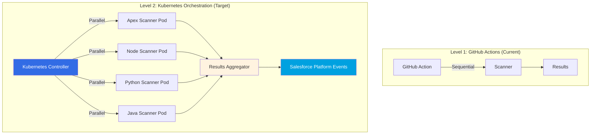
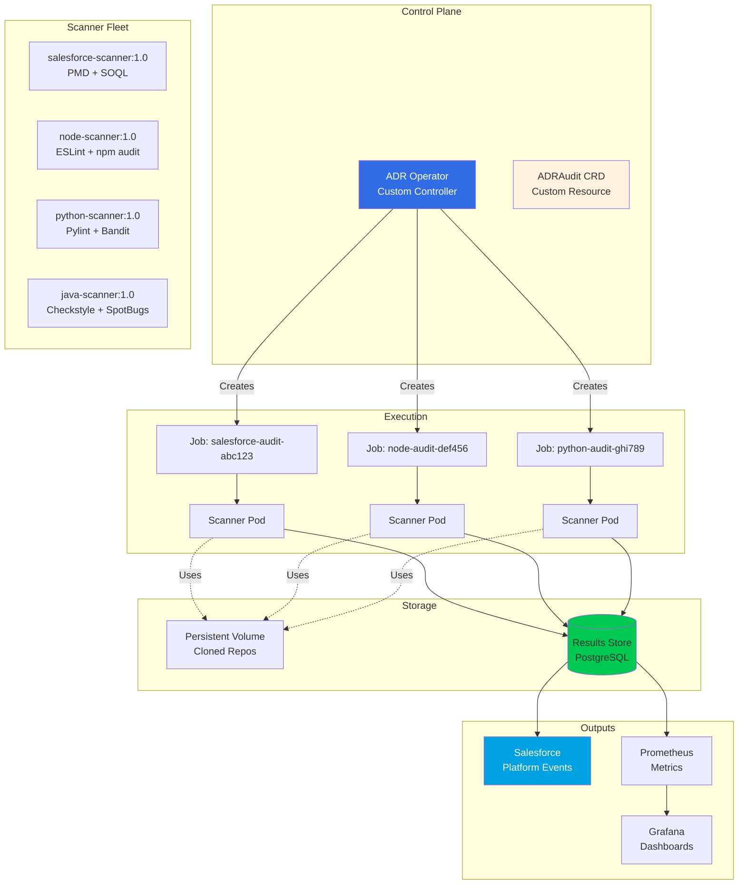
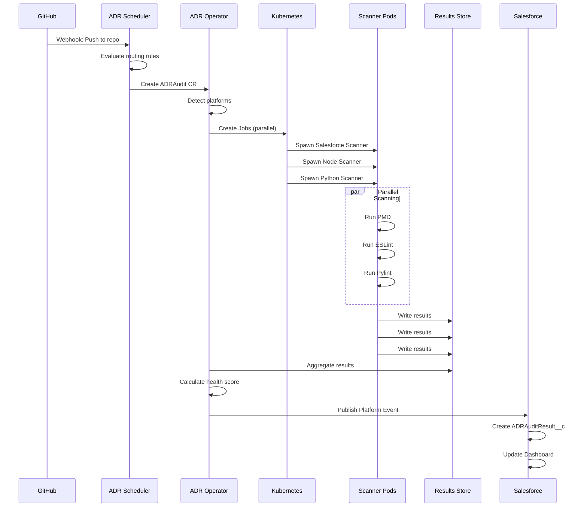
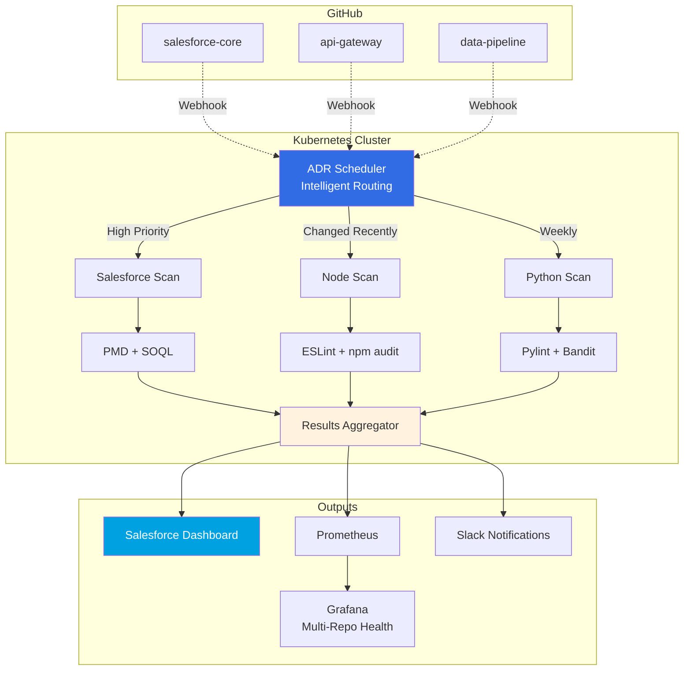

# ADR Enforcer: Kubernetes-Native Architecture

> **Cloud-native ADR governance at enterprise scale**

## Overview



---

## Why Kubernetes?

### **The Problems It Solves**

1. **Parallel Scanning**
    - Scan multiple repos simultaneously
    - Platform-specific scanners run in isolation
    - 10 repos = 10 parallel pods (vs sequential GitHub Actions)

2. **Resource Management**
    - Scanner pods scale up/down based on demand
    - Heavy scanners (PMD, SonarQube) get dedicated resources
    - Cost-efficient: only run when needed

3. **Platform Independence**
    - Each scanner is a container image
    - No "install PMD on GitHub runner" issues
    - Reproducible environments

4. **Enterprise Scale**
    - 100s of repos? No problem.
    - Rate limiting? Kubernetes handles it.
    - Failed scans? Auto-retry with backoff.

5. **Intelligent Routing**
    - Kubernetes decides which scanner(s) to use
    - Multi-platform repos get multiple pods
    - Dependency-based ordering (scan changed files first)

---

## Components



---

## Custom Resource Definition (CRD)

### ADRAudit Resource

```yaml
apiVersion: glassops.io/v1alpha1
kind: ADRAudit
metadata:
    name: salesforce-core-audit
    namespace: adr-enforcement
spec:
    # Repository to audit
    repository:
        url: https://github.com/company/salesforce-core
        ref: main
        cloneDepth: 1

    # ADR configuration
    adrDirectory: docs/adr
    sourceDirectory: force-app/main/default

    # Platform detection
    platforms:
        autoDetect: true
        override:
            - salesforce
            - javascript # For LWC components

    # Scanner configuration
    scanners:
        salesforce:
            enabled: true
            image: glassops/salesforce-scanner:1.0
            resources:
                requests:
                    memory: '512Mi'
                    cpu: '500m'
                limits:
                    memory: '2Gi'
                    cpu: '2000m'
            env:
                - name: PMD_VERSION
                  value: '6.55.0'

        javascript:
            enabled: true
            image: glassops/node-scanner:1.0
            resources:
                requests:
                    memory: '256Mi'
                    cpu: '250m'

    # Output configuration
    outputs:
        salesforce:
            enabled: true
            platformEvent: ADRAuditCompleted__e
            credentials:
                secretRef: salesforce-jwt

        prometheus:
            enabled: true
            pushgateway: http://prometheus-pushgateway:9091

        slack:
            enabled: true
            webhook:
                secretRef: slack-webhook
            channel: '#adr-violations'

    # Schedule
    schedule: '0 0 * * 0' # Weekly on Sunday

    # Retention
    historyLimit: 10 # Keep last 10 audit results

status:
    phase: Running
    healthScore: 73
    lastAuditTime: '2026-01-22T15:30:00Z'
    scanners:
        - platform: salesforce
          status: Completed
          violations: 12
          duration: 45s
        - platform: javascript
          status: Completed
          violations: 3
          duration: 23s
```

---

## ADR Operator (Kubernetes Controller)

```go
// pkg/controller/adraudit_controller.go
package controller

import (
    "context"

    adrv1alpha1 "github.com/glassops/adr-operator/api/v1alpha1"
    batchv1 "k8s.io/api/batch/v1"
    corev1 "k8s.io/api/core/v1"
    metav1 "k8s.io/apimachinery/pkg/apis/meta/v1"
)

type ADRAuditReconciler struct {
    client.Client
    Scheme *runtime.Scheme
}

func (r *ADRAuditReconciler) Reconcile(ctx context.Context, req ctrl.Request) (ctrl.Result, error) {
    log := log.FromContext(ctx)

    // Fetch the ADRAudit instance
    audit := &adrv1alpha1.ADRAudit{}
    if err := r.Get(ctx, req.NamespacedName, audit); err != nil {
        return ctrl.Result{}, client.IgnoreNotFound(err)
    }

    // 1. Clone repository (if not already cached)
    if err := r.cloneRepository(ctx, audit); err != nil {
        return ctrl.Result{}, err
    }

    // 2. Detect platforms (if autoDetect enabled)
    platforms, err := r.detectPlatforms(ctx, audit)
    if err != nil {
        return ctrl.Result{}, err
    }

    // 3. Create scanner jobs for each platform
    for _, platform := range platforms {
        job := r.createScannerJob(audit, platform)
        if err := r.Create(ctx, job); err != nil {
            log.Error(err, "Failed to create scanner job", "platform", platform)
            continue
        }
    }

    // 4. Wait for all jobs to complete
    if !r.allJobsCompleted(ctx, audit) {
        return ctrl.Result{RequeueAfter: 30 * time.Second}, nil
    }

    // 5. Aggregate results
    results, err := r.aggregateResults(ctx, audit)
    if err != nil {
        return ctrl.Result{}, err
    }

    // 6. Calculate health score
    healthScore := calculateHealthScore(results)

    // 7. Update status
    audit.Status.Phase = "Completed"
    audit.Status.HealthScore = healthScore
    audit.Status.LastAuditTime = metav1.Now()

    if err := r.Status().Update(ctx, audit); err != nil {
        return ctrl.Result{}, err
    }

    // 8. Publish results
    if err := r.publishResults(ctx, audit, results); err != nil {
        log.Error(err, "Failed to publish results")
    }

    return ctrl.Result{}, nil
}

func (r *ADRAuditReconciler) createScannerJob(audit *adrv1alpha1.ADRAudit, platform string) *batchv1.Job {
    scannerConfig := audit.Spec.Scanners[platform]

    return &batchv1.Job{
        ObjectMeta: metav1.ObjectMeta{
            Name:      fmt.Sprintf("%s-%s-%s", audit.Name, platform, time.Now().Unix()),
            Namespace: audit.Namespace,
            Labels: map[string]string{
                "audit":    audit.Name,
                "platform": platform,
            },
        },
        Spec: batchv1.JobSpec{
            Template: corev1.PodTemplateSpec{
                Spec: corev1.PodSpec{
                    Containers: []corev1.Container{
                        {
                            Name:  "scanner",
                            Image: scannerConfig.Image,
                            Env: append(scannerConfig.Env, []corev1.EnvVar{
                                {
                                    Name:  "REPO_PATH",
                                    Value: "/workspace",
                                },
                                {
                                    Name:  "ADR_DIR",
                                    Value: audit.Spec.ADRDirectory,
                                },
                                {
                                    Name:  "SOURCE_DIR",
                                    Value: audit.Spec.SourceDirectory,
                                },
                            }...),
                            VolumeMounts: []corev1.VolumeMount{
                                {
                                    Name:      "workspace",
                                    MountPath: "/workspace",
                                },
                                {
                                    Name:      "results",
                                    MountPath: "/results",
                                },
                            },
                            Resources: scannerConfig.Resources,
                        },
                    },
                    Volumes: []corev1.Volume{
                        {
                            Name: "workspace",
                            VolumeSource: corev1.VolumeSource{
                                PersistentVolumeClaim: &corev1.PersistentVolumeClaimVolumeSource{
                                    ClaimName: fmt.Sprintf("%s-workspace", audit.Name),
                                },
                            },
                        },
                        {
                            Name: "results",
                            VolumeSource: corev1.VolumeSource{
                                PersistentVolumeClaim: &corev1.PersistentVolumeClaimVolumeSource{
                                    ClaimName: fmt.Sprintf("%s-results", audit.Name),
                                },
                            },
                        },
                    },
                    RestartPolicy: corev1.RestartPolicyNever,
                },
            },
        },
    }
}
```

---

## Scanner Container Images

### Salesforce Scanner Dockerfile

```dockerfile
# docker/salesforce-scanner/Dockerfile
FROM node:20-alpine

# Install Salesforce CLI
RUN npm install -g @salesforce/cli

# Install PMD
RUN wget https://github.com/pmd/pmd/releases/download/pmd_releases%2F6.55.0/pmd-bin-6.55.0.zip \
    && unzip pmd-bin-6.55.0.zip -d /opt/ \
    && ln -s /opt/pmd-bin-6.55.0/bin/run.sh /usr/local/bin/pmd

# Install ADR scanner
COPY scanner.js /usr/local/bin/adr-scanner
RUN chmod +x /usr/local/bin/adr-scanner

# Install dependencies
COPY package.json /app/
WORKDIR /app
RUN npm install

ENTRYPOINT ["node", "/usr/local/bin/adr-scanner"]
```

### Scanner Script

```javascript
// docker/salesforce-scanner/scanner.js
const ADRParser = require('./lib/parser');
const PMDScanner = require('./lib/pmd-scanner');
const MetadataScanner = require('./lib/metadata-scanner');
const fs = require('fs').promises;

async function main() {
    const repoPath = process.env.REPO_PATH || '/workspace';
    const adrDir = process.env.ADR_DIR || 'docs/adr';
    const sourceDir = process.env.SOURCE_DIR || 'force-app';
    const resultsPath = process.env.RESULTS_PATH || '/results/audit-results.json';

    console.log('Starting Salesforce ADR scan...');
    console.log(`Repository: ${repoPath}`);
    console.log(`ADRs: ${adrDir}`);
    console.log(`Source: ${sourceDir}`);

    // Parse ADRs
    const parser = new ADRParser();
    const adrs = await parser.parseAll(`${repoPath}/${adrDir}`);

    console.log(`Found ${adrs.length} ADRs`);

    // Run scanners
    const results = [];

    for (const adr of adrs) {
        if (!adr.enforcement?.enabled) continue;
        if (adr.enforcement.platform !== 'salesforce') continue;

        console.log(`Scanning ${adr.id}: ${adr.title}...`);

        let scanResult;

        if (adr.enforcement.scanner === 'pmd') {
            const pmd = new PMDScanner();
            scanResult = await pmd.execute(adr.enforcement, `${repoPath}/${sourceDir}`);
        } else if (adr.enforcement.scanner === 'metadata-query') {
            const metadata = new MetadataScanner();
            scanResult = await metadata.execute(adr.enforcement, `${repoPath}/${sourceDir}`);
        }

        results.push({
            adr: {
                id: adr.id,
                title: adr.title
            },
            enforcement: adr.enforcement,
            ...scanResult
        });
    }

    // Calculate health
    const health = calculateHealthScore(results);

    // Write results
    const output = {
        platform: 'salesforce',
        timestamp: new Date().toISOString(),
        health,
        results
    };

    await fs.writeFile(resultsPath, JSON.stringify(output, null, 2));

    console.log(`Scan complete. Health score: ${health.score}/100`);

    // Exit with error if blocking violations found
    if (health.blocking > 0) {
        process.exit(1);
    }
}

function calculateHealthScore(results) {
    const enforced = results.length;
    const compliant = results.filter((r) => r.passed).length;
    const violated = results.filter((r) => !r.passed).length;
    const blocking = results.filter((r) => !r.passed && r.severity === 'blocking').length;
    const warnings = results.filter((r) => !r.passed && r.severity === 'warning').length;

    let score = 100;
    score -= blocking * 10;
    score -= warnings * 2;
    score = Math.max(0, Math.min(100, score));

    return {
        score,
        enforced,
        compliant,
        violated,
        blocking,
        warnings
    };
}

main().catch((err) => {
    console.error('Fatal error:', err);
    process.exit(1);
});
```

---

## Intelligent Repository Routing

### Repository Scheduler CRD

```yaml
apiVersion: glassops.io/v1alpha1
kind: ADRScheduler
metadata:
    name: company-wide-audit
    namespace: adr-enforcement
spec:
    # Discover repositories from GitHub Org
    discovery:
        github:
            organization: company
            excludeRepos:
                - '*.archive'
                - 'test-*'
            credentials:
                secretRef: github-token

    # Intelligent routing rules
    routing:
        rules:
            - name: high-priority-repos
              condition: |
                  repo.name in ["salesforce-core", "api-gateway"] ||
                  repo.topics.contains("production")
              schedule: '0 */6 * * *' # Every 6 hours
              priority: high

            - name: changed-repos
              condition: repo.lastCommitAge < "24h"
              schedule: '0 * * * *' # Hourly
              priority: medium

            - name: all-others
              condition: true
              schedule: '0 0 * * 0' # Weekly
              priority: low

    # Resource allocation
    resources:
        high:
            requests:
                memory: '2Gi'
                cpu: '2000m'
        medium:
            requests:
                memory: '1Gi'
                cpu: '1000m'
        low:
            requests:
                memory: '512Mi'
                cpu: '500m'

    # Concurrency limits
    concurrency:
        maxParallel: 10
        maxPerPlatform: 3
```

---

## Data Flow



---

## Platform Event Publisher (Sidecar)

```yaml
# Kubernetes Job with Salesforce publisher sidecar
apiVersion: batch/v1
kind: Job
metadata:
    name: salesforce-audit-with-publisher
spec:
    template:
        spec:
            containers:
                # Main scanner
                - name: scanner
                  image: glassops/salesforce-scanner:1.0
                  volumeMounts:
                      - name: results
                        mountPath: /results

                # Salesforce publisher sidecar
                - name: publisher
                  image: glassops/sf-publisher:1.0
                  env:
                      - name: SF_CLIENT_ID
                        valueFrom:
                            secretKeyRef:
                                name: salesforce-jwt
                                key: client-id
                      - name: SF_JWT_KEY
                        valueFrom:
                            secretKeyRef:
                                name: salesforce-jwt
                                key: private-key
                      - name: SF_USERNAME
                        valueFrom:
                            secretKeyRef:
                                name: salesforce-jwt
                                key: username
                  volumeMounts:
                      - name: results
                        mountPath: /results
                  command:
                      - /bin/sh
                      - -c
                      - |
                          # Wait for scanner to finish
                          while [ ! -f /results/audit-results.json ]; do sleep 5; done

                          # Publish to Salesforce
                          node /app/publish.js /results/audit-results.json

            volumes:
                - name: results
                  emptyDir: {}

            restartPolicy: Never
```

---

### Installation

```bash
# Install CRDs
kubectl apply -f manifests/crds/

# Install Operator
kubectl apply -f manifests/operator/

# Create namespace
kubectl create namespace adr-enforcement

# Install secrets
kubectl create secret generic salesforce-jwt \
  --from-literal=client-id=$SF_CLIENT_ID \
  --from-literal=private-key="$SF_JWT_KEY" \
  --from-literal=username=$SF_USERNAME \
  -n adr-enforcement
```

### Create ADRAudit Resource

```bash
cat <<EOF | kubectl apply -f -
apiVersion: glassops.io/v1alpha1
kind: ADRAudit
metadata:
  name: salesforce-core
  namespace: adr-enforcement
spec:
  repository:
    url: https://github.com/company/salesforce-core
    ref: main
  adrDirectory: docs/adr
  sourceDirectory: force-app/main/default
  platforms:
    autoDetect: true
  outputs:
    salesforce:
      enabled: true
      credentials:
        secretRef: salesforce-jwt
  schedule: "0 0 * * 0"
EOF
```

### Monitor

```bash
# Watch audit status
kubectl get adraudits -n adr-enforcement -w

# Check scanner pods
kubectl get pods -n adr-enforcement -l audit=salesforce-core

# View logs
kubectl logs -n adr-enforcement -l audit=salesforce-core -f

# Get health score
kubectl get adraudit salesforce-core -n adr-enforcement -o jsonpath='{.status.healthScore}'
```

---

## Advantages Over GitHub Actions

| Aspect               | GitHub Actions                 | Kubernetes                  |
| -------------------- | ------------------------------ | --------------------------- |
| **Parallelism**      | Sequential (or complex matrix) | Native parallel jobs        |
| **Resource Control** | Fixed runner sizes             | Granular CPU/memory limits  |
| **Scaling**          | Limited by runner count        | Auto-scale to 100s of pods  |
| **Cost**             | Per-minute billing             | Spot instances, preemptible |
| **Multi-Repo**       | Separate workflows             | Centralized orchestration   |
| **Platform Support** | Install tools per run          | Pre-built container images  |
| **Failure Handling** | Retry entire workflow          | Retry individual scanners   |
| **Observability**    | GitHub UI only                 | Prometheus + Grafana        |

---

## Cost Optimization

### Spot Instances

```yaml
# Use spot/preemptible nodes for scanner pods
apiVersion: v1
kind: Pod
metadata:
    name: salesforce-scanner
spec:
    nodeSelector:
        cloud.google.com/gke-preemptible: 'true' # GKE
        # or
        eks.amazonaws.com/capacityType: SPOT # EKS
    tolerations:
        - key: 'cloud.google.com/gke-preemptible'
          operator: 'Equal'
          value: 'true'
          effect: 'NoSchedule'
```

### Scanner Pod Caching

```yaml
# Cache scanner images on nodes
apiVersion: apps/v1
kind: DaemonSet
metadata:
    name: scanner-image-puller
spec:
    template:
        spec:
            initContainers:
                - name: pull-salesforce
                  image: glassops/salesforce-scanner:1.0
                  command: ['/bin/true']
                - name: pull-node
                  image: glassops/node-scanner:1.0
                  command: ['/bin/true']
```

---

## The Complete Vision



---

## Why This Is Enterprise-Grade

1. **Scalability**: 100s of repos, 1000s of audits
2. **Reliability**: Kubernetes handles failures, retries
3. **Observability**: Prometheus metrics, Grafana dashboards
4. **Security**: Secrets management, RBAC, network policies
5. **Cost**: Spot instances, resource limits, caching
6. **Flexibility**: Custom scanners, platform detection, routing rules

**This is production infrastructure, not a weekend project.**

But it positions you as someone who thinks at **cloud-native scale**.

---

## Implementation Roadmap

### Phase 1: Proof of Concept (2 weeks)

- [ ] Basic Kubernetes operator
- [ ] ADRAudit CRD
- [ ] Single scanner container (Salesforce)
- [ ] Manual testing

### Phase 2: Multi-Platform (4 weeks)

- [ ] JavaScript scanner container
- [ ] Python scanner container
- [ ] Platform auto-detection
- [ ] Parallel job orchestration

### Phase 3: Enterprise Features (6 weeks)

- [ ] ADRScheduler for multi-repo
- [ ] Intelligent routing
- [ ] Salesforce integration
- [ ] Prometheus metrics

### Phase 4: Production Hardening (4 weeks)

- [ ] Error handling & retries
- [ ] Resource optimization
- [ ] Security audit
- [ ] Documentation

**Total: 16 weeks to production-grade**

---

## The Portfolio Impact

**In interviews:**

> "I built a Kubernetes-native ADR enforcement platform that orchestrates compliance scanning across 50+ repositories in 5 different languages. It uses custom controllers, parallel pod execution, and publishes results to a centralized Salesforce dashboard. Here's the architecture..."

**This demonstrates:**

- Cloud-native engineering
- Kubernetes operator development
- Multi-platform systems thinking
- Enterprise scalability design

**Would you rather show GitHub Actions YAML or a Kubernetes operator?**

---

Want me to prototype:

1. The Kubernetes operator code?
2. The scanner container Dockerfiles?
3. The routing decision algorithm?
